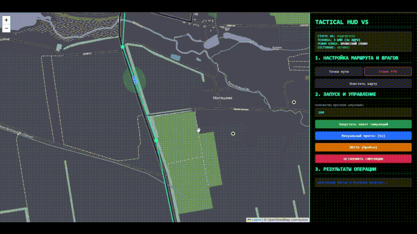
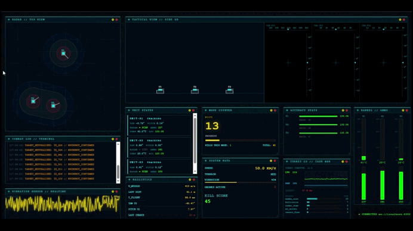
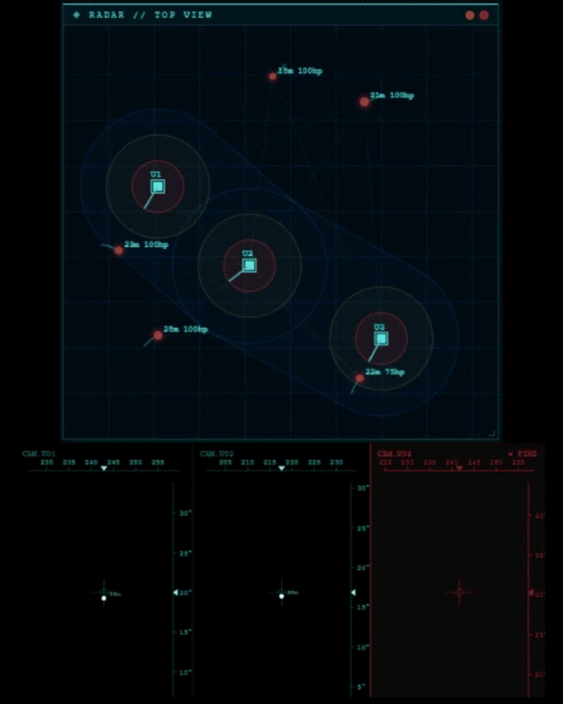
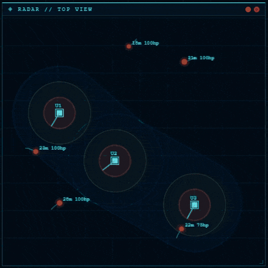

# 🛡️ Комплекс Активной Защиты (КАЗ) «YADRO»

**«YADRO»** — это автоматизированный комплекс активной защиты (модуль КАЗ/C-UAS) для бронетехники (БТР, БМП, грузового автотранспорта, НРК), предназначенный для автоматического уничтожения FPV-дронов, сбрасывателей и барражирующих боеприпасов (класса «Молния») на подлёте с использованием крупной картечи.

---

## 🎯 Принцип работы системы

1. **Детекция и обнаружение (до 300 м):** Радарный комплекс и сенсорные модули фиксируют приближение воздушной угрозы и передают параметры траектории.
2. **Динамический расчет упреждения:** Встроенный алгоритм (архитектура **Mamba + баллистический калькулятор**) мгновенно вычисляет вектор движения цели и наводит ствол не в текущую позицию дрона, а **наперерез ему (в точку встречи)**.
3. **Залп и формирование облака поражения:** Турель производит выстрел картечью. Формируемый веерный сноп гарантированно накрывает маневрирующую цель.

---

## 🎲 Моделирование, варгейминг и перехват целей

Для проверки жизнеспособности концепции было проведено комплексное симуляционное моделирование с просчетом тысяч сценариев атак:

* **Проверка алгоритмов:** Симуляция подтвердила, что архитектура *Mamba + баллистический калькулятор* справляется с математикой упреждения даже при активном маневрировании FPV-дрона на высоких скоростях.
* **Доказательство эффективности:** Моделирование подтвердило, что комплекс успевает засечь, рассчитать и поразить цель до момента её входа в зону критического подрыва.
* **Оптимизация задержек:** В ходе варгейминга рассчитаны критические временные тайминги (от детекции до выстрела) и определены границы эффективного перехвата.

  

<em>Рис. 1. Моделирование движения по дороге и компенсация рельефа.</em>

  

<em>Рис. 2. Инициализация системы и вхождение в единый контур обороны.</em>
  
  

  

<em>Рис. 3. Симуляция отражения атаки и перехвата FPV-дрона в динамике.</em>

  

<em>Рис. 4. Оценка сектора атаки и позиции оператора FPV-дрона.</em>

---

## 🖥️ Тактический интерфейс и визуализация (Tactical HUD)

Для визуализации работы алгоритмов упреждения, контроля зон поражения и мониторинга состояния турели в реальном времени был разработан тактический веб-интерфейс.

  

<em>Рис. 5. Тактический интерфейс в режиме реального времени.</em>

### Ключевые возможности интерфейса:
* **Адаптивная компоновка:** Возможность сворачивать/разворачивать информационные блоки, а также масштабировать UI-элементы под любое разрешение экрана.
* 

  

<em>Рис. 6. Управление элементами мультимодального тактического интерфейса.</em>

**Tactical Radar / Top View:** Отображение динамических зон поражения (60 м — синяя зона, 20 м — рубеж последнего шанса), траекторий целей и векторов упреждения Mamba.

  

<em>Рис. 7. Визуализация радара и камеры верхнего обзора (Top-View Radar).</em>

  

<em>Рис. 8. Мониторинг зоны покрытия и векторов упреждения (Top-View).</em>

* **Телеметрия и статус:** Контроль углов поворота сервоприводов, готовности баллистического калькулятора, температуры ствола и остатка боекомплекта.
* **Мультисенсорный режим:** Вывод видеопотока с тепловизионных/оптических камер и отслеживание статуса смежных турелей в сетевом куполе.

---

## 🔬 Физика системы и баллистика

### 1. Начальная скорость и сопротивление воздуха
* Начальная скорость вылета картечи — **415 м/с** (сверхзвуковая).
* Из-за аэродинамической формы и массы дробины теряют скорость под воздействием сопротивления атмосферы, что учитывается при расчёте кинетической энергии на дистанции.

### 2. Обоснование эффективной дистанции (60 метров)
* **До 60 метров:** Картечь сохраняет высокую пробивную способность (выше 320 м/с). Диаметр снопа составляет **60–70 см**, формируя плотное «пятно» поражения, гарантирующее уничтожение FPV-дрона.
* **Свыше 60 метров (70–100 м):** 
  1. Картечь теряет убойную силу, достаточную для разрушения элементов конструкции цели.
  2. Избыточное рассеивание снопа создаёт пропуски («дыры») между дробинами, сквозь которые дрон может пройти без повреждений.

### 3. Гравитационные поправки
* Баллистический калькулятор автоматически рассчитывает провисание траектории полета картечи на дистанции 60 м и вносит поправку по высоте, удерживая центр снопа на цели.

### 4. Ведение огня в движении
При движении носителя по пересечённой местности алгоритм компенсирует два фактора:
1. **Вектор движения носителя:** Собственная скорость техники суммируется с вектором полёта картечи. Калькулятор пересчитывает угол прицеливания в реальном времени.
2. **Вибрации и раскачка:** Модуль упреждения непрерывно компенсирует колебания корпуса на неровностях, удерживая ствол в точке встречи.

---

## 🌐 Сетевое взаимодействие (Общий купол обороны)

Модуль `network/` объединяет несколько комплексов «YADRO» в единую защитную сеть:

* **Автоматическое распределение целей (Анти-дублирование):** При групповом нападении или атаке роя FPV-дронов комплексы обмениваются координатами угроз. Система распределяет секторы огня, исключая захват одной цели несколькими турелями.
* **Единый контур безопасности:** При движении в колонне перекрывающие друг друга 60-метровые зоны отдельных машин формируют сплошной защитный купол. При выходе цели из сектора одной машины её мгновенно подхватывает соседний комплекс.

  

<em>Рис. 9. Динамический расчет векторов движения техники и баллистических поправок.</em>

---

## 🛑 Эшелонированные зоны защиты

* 🟦 **Синяя зона (60 метров) — Основной рубеж:**  
  Штатный режим ведения огня. Экономичный расход боекомплекта, уничтожение угрозы на безопасном удалении.
  
* 🟥 **Красная зона (20 метров) — «Last Chance Line» (Рубеж последнего шанса):**  
  Критический рубеж. При прорыве цели на высоком углу атаки включается **форсаж сервоприводов** (поворот до 700°/сек) и расширяются допуски прицеливания для максимального темпа огня.

---

Проект оптимизирован для работы на доступном вычислительном оборудовании:

| Компонент | Минимальные спецификации | Назначение |
| :--- | :--- | :--- |
| **CPU** | Intel Xeon (многопоточный) | Многопоточный расчёт физики и баллистики |
| **GPU** | NVIDIA GTX 1050 | Обработка видеопотока и работы нейросети |
| **RAM** | 16 ГБ | Оперативная память для работы модулей |

## 🛠️ Стек технологий и зависимости

Проект разработан на **Python 3** с использованием аппаратного ускорения **NVIDIA CUDA**:

### 🧠 ИИ, Математика и Вычисления
* **`torch` (PyTorch)** — вычисления на тензорах и работа нейросетевых моделей упреждения.
* **`sympy`** — символьная математика и точные баллистические расчёты.
* **`numpy`** — векторные вычисления и операции с матрицами пространственных координат.
* **`networkx`** — моделирование графов и сетевого взаимодействия между турелями.
* **`mpmath`** — вычисления с произвольной точностью для сложных траекторий.

### 🎮 Визуализация и Симуляция (HUD)
* **`pygame`** — 2D-визуализация, отрисовка тактического HUD, симуляция варгейминга и радара в реальном времени.

### ⚡ Аппаратное ускорение (CUDA Stack)
* **`CUDA Toolkit` / `cuDNN` / `Triton`** — глубокая интеграция с GPU (NVIDIA GTX 1050) для параллельных расчётов математики Mamba и баллистики с минимальной задержкой.

---

> *Проект разрабатывается автором самостоятельно в качестве инициативной разработки.*
---

## 💖 Поддержать развитие проекта / Support

Разработка алгоритмов СУО **«YADRO»** и симуляционной среды ведётся как инициативный проект. Если вы хотите поддержать дальнейшие исследования, переход к натурным испытаниям на реальных стендах и развитие математической модели — вы можете сделать вклад:

  
  

### 🪙 Криптографические реквизиты (Crypto)

* **USDT (Network: TRC-20 / TRON):** `TRhpnXvkAf6v1nWBUg5tuNeSyben2k8R3E`
* **Bitcoin (Network: Bitcoin / SegWit):** `bc1qh73hx6zsr5mml47qmd33aflrjfnv8mt5wu05xh`

---
